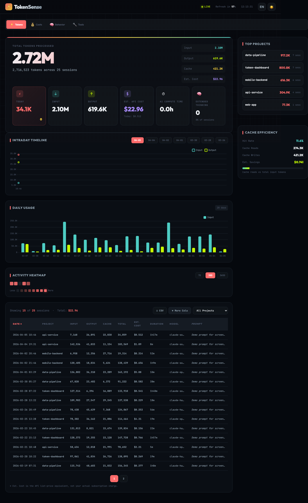

# TokenSense ⚡


> Understand your Claude Code token usage and become a smarter AI user

[](https://choosealicense.com/licenses/mit/)
[](https://nodejs.org/)
[](https://claude.com/code)

[中文](./docs/README.zh.md) | [Full Documentation](./docs/README.md)

A visualization tool for Claude Code token usage. Parses session logs and generates an interactive HTML dashboard showing token consumption patterns.



## Quick Start

```bash
git clone https://github.com/LCehoennardo/TokenSense.git
cd TokenSense
node src/server.js
open http://localhost:3000
```

Done. You'll see your token usage dashboard with auto-refresh every 60s.

## What you'll see

- Total tokens (input / output / cache creation / cache read)
- Estimated API costs broken down by model and project
- Daily usage trends and activity heatmap
- Tool usage analytics (Read/Write/Edit/Bash, MCP tools, Skills)
- All sessions in a sortable, filterable table

## Token-Insights Skill

Generate a one-time static report directly inside Claude Code:

```bash
cp -r skills/token-insights ~/.claude/skills/
```

Then run `/token-insights` in Claude Code.

## Requirements

- Node.js 14+
- Claude Code with session logs at `~/.claude/projects/`

## License

MIT
