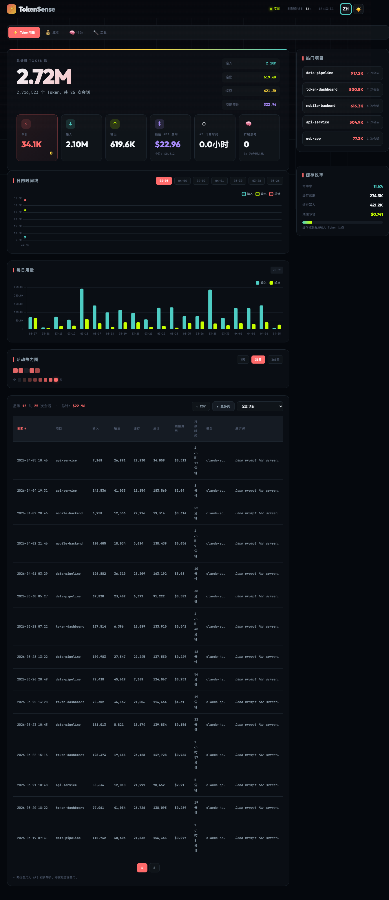

# TokenSense ⚡


> 了解你的 Claude Code 消费，做聪明的 AI 用户

[](https://choosealicense.com/licenses/mit/)
[](https://www.python.org/)
[](https://claude.com/code)

[English](./README.md)

Claude Code Token 使用可视化工具。解析会话日志并生成交互式 HTML 仪表板，展示 Token 消耗模式。



## 这是什么？

TokenSense 读取你的 Claude Code 会话日志，生成交互式仪表板，展示：

- Token 总量（输入 / 输出 / 缓存创建 / 缓存读取）
- 预估 API 费用
- 每日用量趋势（柱状图）
- 活动热力图（7天 / 30天 / 365天）
- 项目与模型排行
- 所有会话（可排序、可筛选）

## 输入 → 输出

| | 内容 |
|---|---|
| **输入** | 来自 `~/.claude/projects/` 的会话 `.jsonl` 文件 |
| **输出** | `data/token_data.js`（自动生成的 JavaScript 文件） |
| **查看** | `src/token_visual.html`（浏览器中打开） |

## 零思考启动

```bash
# 1. 克隆仓库
git clone https://github.com/LCehoennardo/TokenSense.git
cd TokenSense

# 2. 进入源码目录
cd src

# 3. 运行（一次性）
python3 refresh_token_data.py --once

# 4. 打开仪表板
open token_visual.html
```

完成。仪表板已就绪。

## 项目结构

```
TokenSense/
├── src/                              # 在此目录运行命令
│   ├── refresh_token_data.py         # 主脚本（读取日志 → 生成数据）
│   ├── token_visual.html             # 仪表板（浏览器中打开）
│   ├── style.css                     # 仪表板样式
│   └── app.js                        # 仪表板逻辑
├── data/                             # 自动生成（gitignore）
│   ├── token_data.js                 # Python 脚本生成
│   ├── .session_cache.json           # 会话解析缓存
│   └── .summary_cache.json           # 汇总缓存
└── docs/                             # 文档
```

## 命令

```bash
cd src

# 一次性运行（推荐首次使用）
python3 refresh_token_data.py --once

# 持续运行模式（每 60 秒自动刷新）
python3 refresh_token_data.py
```

## 环境要求

- Python 3.8+
- Claude Code（会话日志位于 `~/.claude/projects/`）

## License

MIT License - 详见 [LICENSE](LICENSE) 文件。